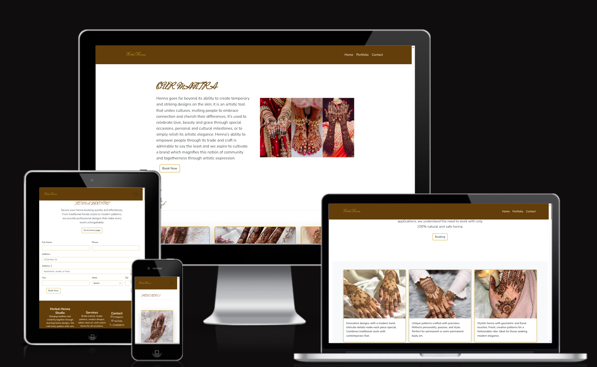
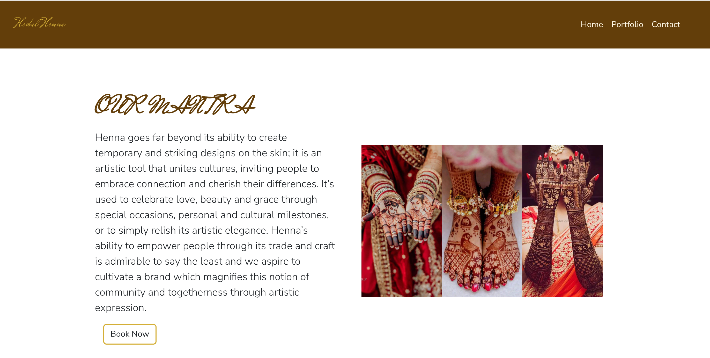
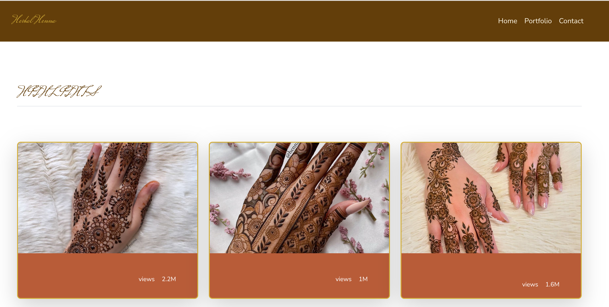
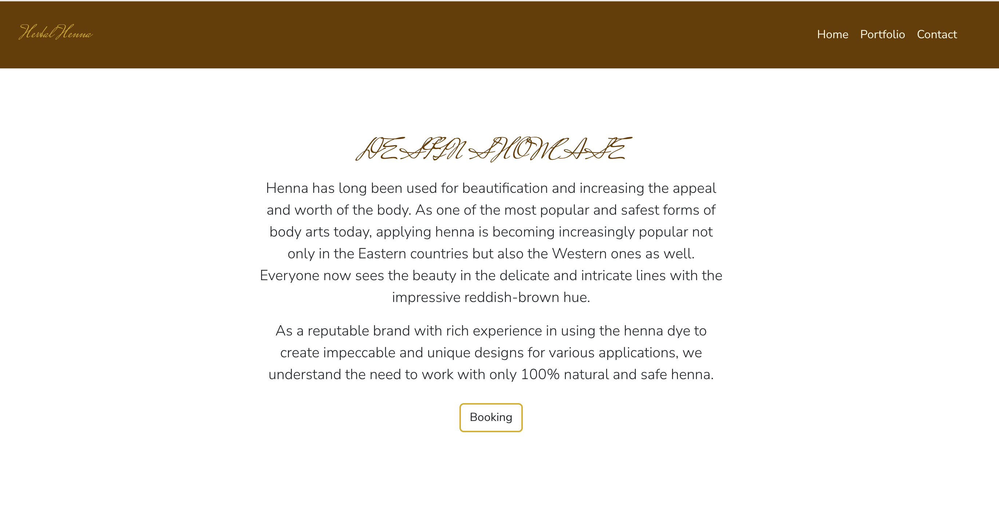
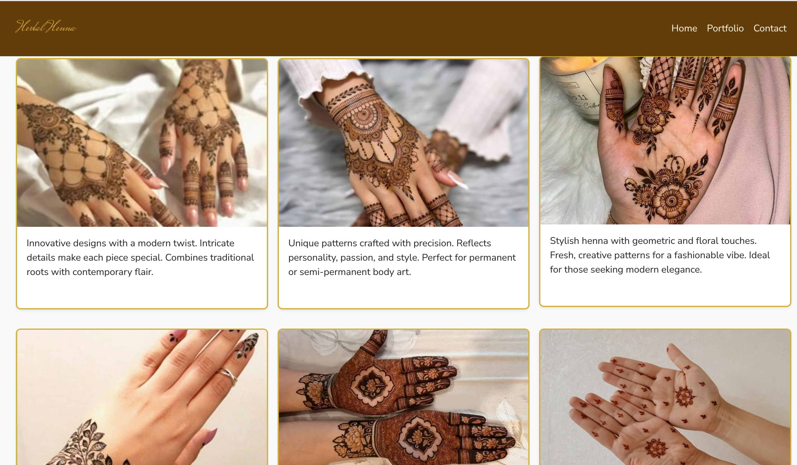
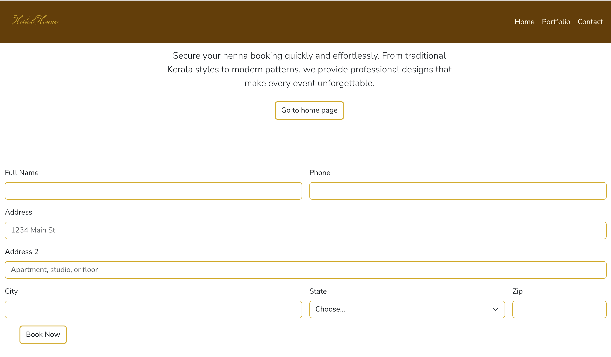
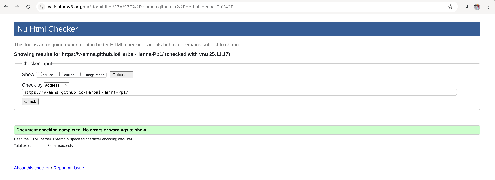
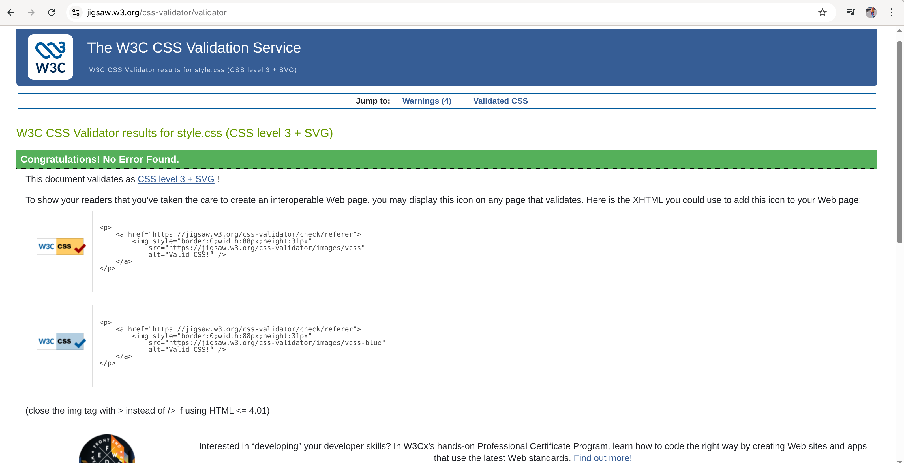

 # Herbal-Henna-Pp1
Herbal Henna is a website designed to showcase natural henna artistry and provide users with a simple way to explore designs and book appointments. The project is aimed at individuals looking for high-quality, safe, and beautifully crafted henna for weddings, cultural celebrations, festivals, or personal style. With a focus on tradition blended with modern creativity, the site highlights a gallery of unique designs, offers essential service information, and ensures visitors can easily navigate to contact and booking options. Herbal Henna serves as a digital portfolio and booking platform, helping clients discover the art of henna and connect effortlessly with the artist.

## 📱 Responsive Design Preview

## Features

### 1. Fully Responsive Design

The website is designed to adapt seamlessly across all screen sizes — desktop, tablet, and mobile — ensuring a smooth user experience on any device.

### 2. Modern & Elegant UI

A calm, earthy color palette combined with clean typography creates a visually appealing atmosphere that matches the natural theme of henna art.

### 3. Portfolio Gallery

A dedicated portfolio page showcases different henna design styles (modern, traditional, and artistic) with high-quality images organized in responsive grid layouts.

### 4. Contact & Booking Section

A simple and user-friendly contact form allows visitors to easily reach out or book an appointment.

### 5. Sticky Navigation Bar

A fixed header ensures users can always access navigation links without scrolling back up.

### 6. Accessibility-Friendly Structure

Semantic HTML elements, descriptive alt text, and ARIA labels improve usability for assistive technologies.

### 7. Lightweight & Fast

Built using HTML, CSS, and Bootstrap — keeping load times fast and performance smooth without unnecessary libraries.

## HERBAL HENNA

### Home Page (index.html)

The Home Page of the Herbal Henna website serves as the welcoming entry point for users. It introduces the brand, highlights the beauty and cultural significance of henna art, and guides visitors to explore the portfolio or make a booking. The page features a clean layout, responsive navigation, and visually appealing imagery that reflects the creativity and elegance of henna designs.

### Highlight Section

The Highlight Section showcases key aspects of Herbal Henna’s services and designs. It emphasizes the brand’s expertise, use of 100% natural henna, and the variety of modern and traditional designs available.

## Portfolio Page

The Portfolio Page displays a curated collection of Herbal Henna’s designs, including both modern and traditional styles. Each design is presented with images and brief descriptions, allowing visitors to explore the artistry and intricacy of the henna work. This page helps potential clients see the quality and variety of designs before booking a session.

## Footer

The Footer Section provides essential contact information and quick links to Herbal Henna’s social media profiles. It also highlights services offered and includes a brief brand description, ensuring visitors can easily connect and learn more about the studio.

## Contact Page
The Contact Page allows visitors to easily reach out to Herbal Henna Studio. It includes a contact form, phone number, and links to social media profiles, making it simple for users to book appointments or ask questions.

## Features Left to Implement

In future updates, the Herbal Henna project will include an additional page to offer homemade henna products for customers. The highlight section will also be enhanced to display key metrics, such as the number of visitors who have viewed the henna designs, providing better engagement insights.

## Testing

The Herbal Henna website has been tested across multiple browsers, including Google Chrome, Mozilla Firefox, to ensure consistent appearance and functionality. The site is fully responsive, adapting smoothly to different screen sizes, from desktop monitors to tablets and mobile devices.

During testing, the layout of the portfolio gallery and the navigation bar was carefully checked to ensure proper alignment and spacing on smaller screens. The highlight section and images also scale appropriately without overlapping or distortion.

Some interesting issues observed during testing include:

**Minor inconsistencies in font sizes and spacing in older browser versions.**

**Occasionally, large images in the portfolio section caused vertical scroll overflow on very small mobile screens.**

These issues have been noted for future improvement to ensure a fully seamless user experience across all platforms.

## Validator Testing

**HTML**

No errors and warnings found.

**CSS**

No errors and warnings found.

### Known Issues / Unfixed Bugs

During testing for responsiveness using ami.responsivedesign.is, all screen sizes display correctly. However, a horizontal scrollbar appears on every page, stretching from the header to the footer. The cause of this issue is currently unclear—it may be related to certain elements exceeding the viewport width or default padding/margin in the CSS. This bug has not yet been resolved.

## Deployment

The site was deployed to GitHub pages. The steps to deploy are as follows:
In the GitHub repository, navigate to the Settings tab
From the source section drop-down menu, select the Master Branch
Once the master branch has been selected, the page will be automatically refreshed with a detailed ribbon display to indicate the successful deployment.
The live link can be found here - https://v-amna.github.io/Herbal-Henna-Pp1/

## Credits

### Content

The project incorporates a combination of external resources and frameworks to enhance design consistency and user experience:

### Google Fonts
Used to apply custom typography throughout the website, ensuring a clean and modern visual style.
### Icons
Icons were sourced from [Iconify](https://icon-sets.iconify.design) to provide lightweight, scalable, and visually appealing icons across the site.

### Bootstrap 5.3 Framework
Bootstrap was used for layout structure, responsive grid design, and UI components such as the navigation bar, cards, and form elements. This ensured the website remains responsive across various screen sizes.

### Media

The media content and supporting resources used throughout the project were gathered from the following sources:

ChatGPT – Used for assistance with content creation,  and improving the structure of written text.

Google.com – Used for general research, reference images, and gathering information related to henna designs and styling inspiration.
